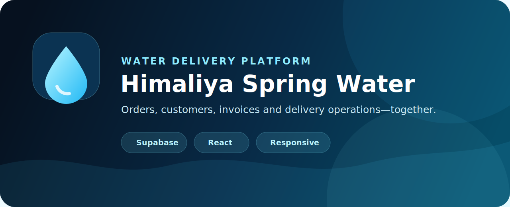
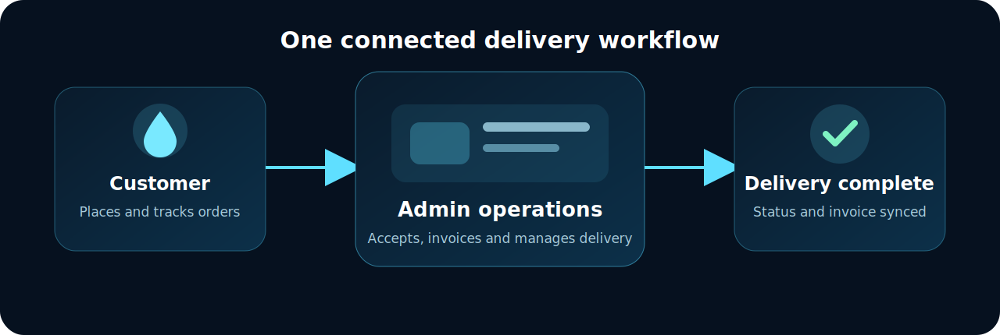

<div align="center">



# Himaliya Spring Water

A responsive water-delivery operations platform for administrators and customers, powered by React and Supabase.

[](https://react.dev/)
[](https://supabase.com/)
[](https://www.netlify.com/)

</div>

## Overview

Himaliya Spring Water combines day-to-day delivery administration with a dedicated customer ordering portal. Administrators can manage customers, sales, invoices, prices, users, notifications, and order progress. Customers can place orders, monitor their status, maintain their profile, and access invoices linked specifically to their account.



## Features

### Administration

- Customer records with purchase history, editing, secure deletion, and PDF export
- Customer-order queue with pending, accepted, delivered, rejected, and canceled states
- Daily sales entry with quantity, unit price, and calculated totals
- Invoice generation, validation, payment tracking, lookup, and customer linking
- Analytics, delivery history, customer map, notifications, and global search
- Admin and customer-user management
- Fixed bottle pricing and configurable order workflow
- Responsive dark/light themes and dashboard-shaped loading skeletons

### Customer portal

- Customer sign-in and account creation
- Water ordering with live bottle prices and calculated totals
- Compact, scrollable order history with status updates
- Account-specific invoices and payment status
- Customer notifications and optional browser alerts
- Private profile/settings page with editable delivery details and theme selection

## Technology

| Layer | Technology |
| --- | --- |
| Frontend | React 18, React Router, Redux, Reactstrap |
| Motion | Framer Motion |
| Backend | Supabase Auth and PostgreSQL |
| Data security | Row Level Security policies and authenticated REST access |
| Documents | jsPDF invoice and customer-statement exports |
| Deployment | Netlify SPA redirects and production build configuration |

## Local setup

### 1. Install dependencies

```bash
npm install --legacy-peer-deps
```

### 2. Configure Supabase

Copy `.env.example` to `.env` and provide the project values:

```env
REACT_APP_SUPABASE_URL=https://your-project.supabase.co
REACT_APP_SUPABASE_ANON_KEY=your-publishable-or-anon-key
```

Never place a Supabase `service_role` key in this browser application.

For owner-authorized customer password resets on Netlify, add `SUPABASE_SERVICE_ROLE_KEY` in **Netlify → Site configuration → Environment variables**. Never prefix it with `REACT_APP_`; the key is consumed only by the server function.

In **Supabase → Authentication → URL Configuration**, add the deployed `/reset-password` URL (and `http://localhost:3000/reset-password` for local testing) to the allowed redirect URLs.

### 3. Apply database migrations

Review and apply the SQL files under [`supabase/migrations`](supabase/migrations) in chronological order. Back up an existing production database before applying schema changes.

### 4. Start development

```bash
npm start
```

The application runs at [http://localhost:3000](http://localhost:3000).

## Useful commands

```bash
npm start                  # Development server
npm run build              # Optimized production build
npm test                   # Test suite
```

## Main routes

| Route | Purpose |
| --- | --- |
| `/` | Public landing page |
| `/login` | Administrator sign-in |
| `/customer/login` | Customer sign-in and registration |
| `/customer/app` | Customer ordering portal |
| `/customer/profile` | Customer profile and appearance settings |
| `/app/main/dashboard` | Operations dashboard |
| `/app/customer-orders` | Customer-order management |
| `/app/customers` | Customer records and invoice register |
| `/app/daily-sales` | Daily sales entry |
| `/app/invoice-lookup` | Invoice search and validation |
| `/app/analytics` | Business analytics |
| `/app/users` | Admin and customer-user management |
| `/app/settings` | Business, pricing, workflow, and theme settings |

## Deployment

The repository includes Netlify SPA routing through `public/_redirects` and `netlify.toml`. Configure the same Supabase environment variables in the deployment provider, then deploy the generated `build` directory.

## Security notes

- Public clients use only the publishable/anonymous Supabase key.
- Sensitive operations must remain protected by Supabase RLS and server-side authorization.
- Customer invoices and notifications are scoped to authenticated customer ownership.
- Do not commit `.env`, passwords, private keys, or service-role credentials.

---

<div align="center">Built for Himaliya Spring Water, Sialkot Cantt.</div>
