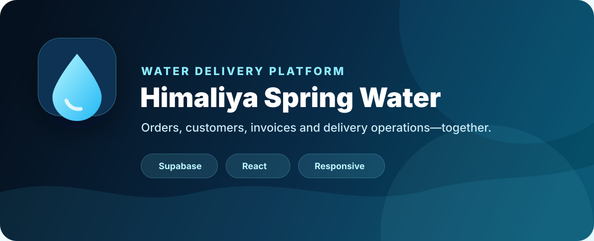
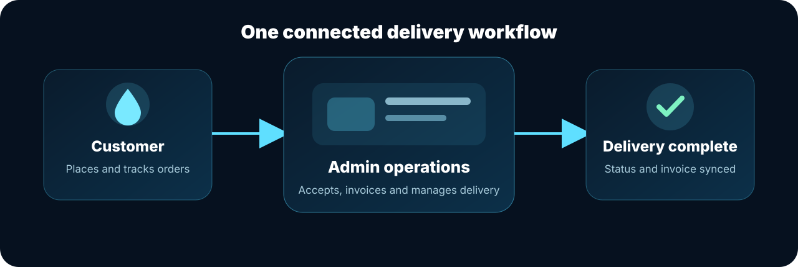

<div align="center">



# Himaliya Spring Water

A responsive water-delivery operations platform for administrators and customers, powered by React and Supabase.

[](https://react.dev/)
[](https://supabase.com/)
[](https://www.netlify.com/)

</div>

## Overview

Himaliya Spring Water combines day-to-day delivery administration with a dedicated customer ordering portal. Administrators can manage customers, sales, invoices, prices, users, notifications, and order progress. Customers can place orders, monitor their status, maintain their profile, and access invoices linked specifically to their account.



For a click-by-click operational handover covering access, customer records, sales, orders, invoices, payments, pricing, users, and passwords, open the [client workflow guide](docs/client-workflow-guide.html) in a browser. It can also be printed or saved as a PDF.

## Features

### Administration

- Customer records with purchase history, editing, secure deletion, and PDF export
- Customer-order queue with pending, accepted, delivered, rejected, and canceled states
- Daily sales entry with quantity, unit price, and calculated totals
- Invoice generation, validation, payment tracking, lookup, and customer linking
- Analytics, delivery history, customer map, notifications, and global search
- Admin and customer-user management
- Fixed bottle pricing and configurable order workflow
- Responsive dark/light themes and dashboard-shaped loading skeletons

### Customer portal

- Customer sign-in and account creation
- Water ordering with live bottle prices and calculated totals
- Compact, scrollable order history with status updates
- Account-specific invoices and payment status
- Customer notifications and optional browser alerts
- Private profile/settings page with editable delivery details and theme selection

## Technology

| Layer | Technology |
| --- | --- |
| Frontend | React 18, React Router, Redux, Material UI 5 |
| Motion | Framer Motion, Motion, Anime.js, Lottie |
| Backend | Supabase Auth and PostgreSQL |
| Data security | Row Level Security policies and authenticated REST access |
| Documents | jsPDF invoice and customer-statement exports |
| Deployment | Netlify SPA redirects and production build configuration |

## Local setup

### 1. Install dependencies

```bash
npm install --legacy-peer-deps
```

### 2. Configure Supabase

Copy `.env.example` to `.env` and provide the project values:

```env
REACT_APP_SUPABASE_URL=https://your-project.supabase.co
REACT_APP_SUPABASE_ANON_KEY=your-publishable-or-anon-key
```

Never place a Supabase `service_role` key in this browser application.

For owner-authorized customer password resets on Netlify, add `SUPABASE_SERVICE_ROLE_KEY` in **Netlify → Site configuration → Environment variables**. Never prefix it with `REACT_APP_`; the key is consumed only by the server function.

Customer phone-number sign-in uses the same server-only key to securely resolve a customer record to its Supabase Auth account. Also configure `SUPABASE_URL` and `SUPABASE_ANON_KEY` in Netlify (the existing `REACT_APP_` equivalents remain supported).

In **Supabase → Authentication → URL Configuration**, add the deployed `/reset-password` URL (and `http://localhost:3000/reset-password` for local testing) to the allowed redirect URLs.

### 3. Apply database migrations

Review and apply the SQL files under [`supabase/migrations`](supabase/migrations) in chronological order. Back up an existing production database before applying schema changes.

The latest migrations add cloud-synced customer preferences and repair missing Auth token defaults left by older manual `auth.users` inserts. That repair is required if an existing account returns `500: Database error querying schema` during sign-in.

### 4. Start development

```bash
npm start
```

The application runs at [http://localhost:3000](http://localhost:3000).

### 5. Enable background notifications (optional)

Out of the box, alerts are shown only while the app is open. Delivering them while
the browser is **closed** needs two things: a VAPID public key in the client build,
and a server that signs and sends each push. The server is the `send-push` Supabase
Edge Function in [`supabase/functions/send-push`](supabase/functions/send-push); the
database trigger added in
[`20260809120000_web_push_dispatch.sql`](supabase/migrations/20260809120000_web_push_dispatch.sql)
invokes it automatically for every new notification.

1. **Generate a VAPID key pair** (already done for the default `.env.example` key —
   run this to mint your own):

   ```bash
   node scripts/generate-vapid-keys.js
   ```

2. **Set the public key** as a client build variable (locally in `.env`, and in
   Netlify / your host and CI alongside the other `REACT_APP_*` values):

   ```env
   REACT_APP_VAPID_PUBLIC_KEY=<public key from step 1>
   ```

3. **Deploy the sender** and give it its secrets. `SUPABASE_URL` and
   `SUPABASE_SERVICE_ROLE_KEY` are injected automatically; set the rest yourself:

   ```bash
   supabase functions deploy send-push
   supabase secrets set \
     VAPID_PRIVATE_KEY=<private key from step 1> \
     PUSH_DISPATCH_SECRET=<a long random string> \
     VAPID_SUBJECT=mailto:you@yourdomain.com
   ```

4. **Point the database trigger at the function.** In the Supabase SQL editor
   (service role), store the function URL and the *same* `PUSH_DISPATCH_SECRET`:

   ```sql
   insert into private.push_dispatch_config (function_url, dispatch_secret)
   values (
     'https://<project-ref>.supabase.co/functions/v1/send-push',
     '<the PUSH_DISPATCH_SECRET from step 3>'
   )
   on conflict (id) do update
     set function_url = excluded.function_url,
         dispatch_secret = excluded.dispatch_secret,
         enabled = true,
         updated_at = now();
   ```

Once the key is present the Settings → Notifications card reports *"Background
delivery is configured."* To confirm end to end, enable notifications on a device,
fully close the app, and have another account trigger an event (a new order, a
delivery update). Endpoints that a push service reports as gone are deactivated
automatically. To pause background delivery without redeploying, set
`enabled = false` on that config row.

## Useful commands

```bash
npm start                  # Development server
npm run build              # Optimized production build
npm test -- --runInBand    # Test suite
npm audit --omit=dev       # Production dependency audit
```

## Main routes

| Route | Purpose |
| --- | --- |
| `/` | Public landing page |
| `/login` | Administrator sign-in |
| `/customer/login` | Customer sign-in and registration |
| `/customer/app` | Customer ordering portal |
| `/customer/profile` | Customer profile and appearance settings |
| `/app/main/dashboard` | Operations dashboard |
| `/app/customer-orders` | Customer-order management |
| `/app/customers` | Customer records and invoice register |
| `/app/daily-sales` | Daily sales entry |
| `/app/invoice-lookup` | Invoice search and validation |
| `/app/analytics` | Business analytics |
| `/app/users` | Admin and customer-user management |
| `/app/settings` | Business, pricing, workflow, and theme settings |

## Deployment

The repository includes Netlify SPA routing through `public/_redirects` and `netlify.toml`.
Production builds on Netlify use its primary `URL` to generate the canonical link, `og:url`, and `sitemap.xml`.
Vercel builds use `VERCEL_PROJECT_PRODUCTION_URL` (falling back to `VERCEL_URL`) for the same output when system environment variables are exposed.
For another host or a local release build, set `SITE_URL` to the final public base URL before running the build.

For a one-time local production deploy:

```bash
npx netlify login
npx netlify link                 # select the existing Netlify site
npm run deploy:netlify
```

The deploy command publishes the generated `build` directory. Netlify CLI reads `NETLIFY_AUTH_TOKEN` and
`NETLIFY_SITE_ID` when running non-interactively, so the same command can be used in CI.

To enable automatic production deploys from GitHub, add these repository secrets under **Settings → Secrets and variables → Actions**:

- `NETLIFY_AUTH_TOKEN` — a Netlify personal access token
- `NETLIFY_SITE_ID` — the site ID from Netlify site settings
- `REACT_APP_SUPABASE_URL` and `REACT_APP_SUPABASE_ANON_KEY` — the browser-safe Supabase project values

Add a repository variable named `SITE_URL` containing the final public origin, such as `https://water.example.com`.
The CI build uses it for canonical metadata, the social URL, and `sitemap.xml`.

The included `.github/workflows/deploy-netlify.yml` then deploys every push to `main`. Netlify Functions use their
own site environment variables (`SUPABASE_URL`,
`SUPABASE_ANON_KEY`, and `SUPABASE_SERVICE_ROLE_KEY`); keep the service-role key in Netlify only and never expose it
as a `REACT_APP_*` variable.

## Security notes

- Public clients use only the publishable/anonymous Supabase key.
- Sensitive operations must remain protected by Supabase RLS and server-side authorization.
- Customer invoices and notifications are scoped to authenticated customer ownership.
- Do not commit `.env`, passwords, private keys, or service-role credentials.

---

<div align="center">Built for Himaliya Spring Water, Sialkot Cantt.</div>
